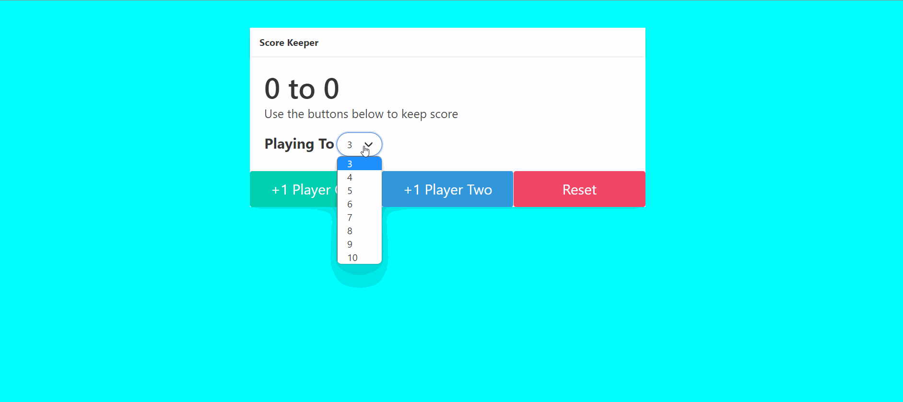

# Score Keeper

It is a simple web app made using HTML, CSS and Javascript to keep score of two players. You can increase the max score through the input. It is a small yet efficient project using js which allows to learn and understand eventhandling and basics of js.

## Technology

- HTML 
- CSS
- JavaScript
- bulma

## DEMO

Gif - ScoreKeeper

 

Image 1 - Reset

 

Image 2 - End of Game

 
